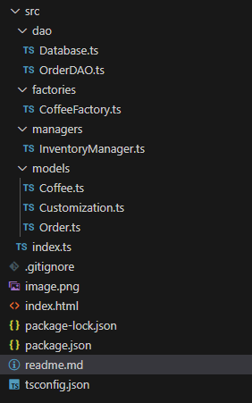

# Coffee Shop Management System - Technical Implementation

## Overview
Complete TypeScript implementation of a café management system with browser-based IndexedDB persistence following strict design patterns.
## Technical Specifications

1. **Design Patterns**:
   - DAO (Data Access Object) pattern
   - Factory Method pattern (Coffee creation)
   - Singleton pattern (InventoryManager)
   - Decorator pattern (Customizations)

2. **Persistence**:
   - IndexedDB for browser-side storage
   - Automatic order persistence between sessions

3. **TypeScript Features**:
   - Async/await for all database operations
   - Strong typing throughout
   - Abstract classes/interfaces

4. **Key Components**:
   - Coffee: Base abstract class with Espresso/Latte/Cappuccino implementations
   - Customization: Add-on ingredients
   - Order: Composite of coffee + customizations
   - InventoryManager: Singleton stock controller

## Class diagramme

## Installation

### Steps
1. Clone repository:

git clone https://github.com/your-repo/coffee-shop-system.git
cd coffee-shop-system
2. 
### Run the web app:
npm i
npm run build
npm start
### Link of the app
#### http://localhost:3000

## Complete File Structure
